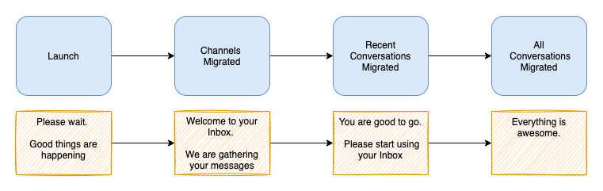

#  Migration Discussion

## Decision: Let's migrate on the fly
Migrate on demand. Its simpler and we dont have to worry about deltas or syncing.
- Migrate the accounts, brands, channels via existing api. the volume is small, and you get immediate feedback about success/failure
- Migrate the conversations, messages, attachments in bulk

## Migration overview

Note: For understanding purposes-only. Does not show actual messages shown to C1.

## Before Migration
Before the migration, another initiative will make sure that every C1 in GoDaddy will get a WebChat channel. Which would in turn create an account/brand/channel in reamaze platform. The account status is `active` and this status is unaffected during the migration. An additional field `migration_status = not-started` will capture the status of the migration.

## During Migration
Client downloads new version of the mobile app. This app's backend is re:amaze platform. It does not know how to contact Conversations. When app is launched the following happens:
- Mobile app calls reamaze /accounts
   - Reamaze internally calls Conversation api to check if this account needs to be migrated. Because reamaze cannot differentiate between an account that needs migration vs an account that was never in Conversations db
   - Reamaze returns `migration_status = not-started` to the mobile app
- Mobile app calls reamaze /migrate
- Mobile app polls reamaze /check-migration-status periodically
  - When `migration status = channels-migrated`
    - Mobile app calls /accounts to get everything
    - C1 is taken to Inbox View
    - Inbox will be empty, or contain web chat messages from reamaze
  - When `migration status = recent-messages-migrated`
    - Mobile app calls /accounts to get everything
    - Inbox is reloaded
    - C1 is instructed to start using the Inbox
  - When `migration status = completed`
    - Mobile app calls /accounts to get everything
    - Inbox is reloaded

## What happens within reamaze /migrate api
- Reamaze /migrate will drop a background job and return immediately
- Reamaze bakground job
  - Update `migration_status = migrating`
  - Call conversations /configs-migration (synchronously)
    - Conversations returns channels. This data is application-encrypted and cannot be read directly by reamaze
    - Create/Update channels into reamaze
  - Update `migration_status = channels-migrated`
  - Read recent threads/messages from dynamodb and adds into reamaze
  - Update `migration_status = recent-messages-migrated`
  - Read all threads/messages from dynamodb and adds into reamaze
  - Update `migration_status = completed`

## Handling failures
- Failure in channels migration
  - Account updated `migration_status = channel-failure`
  - Reamaze /check-migration-status should return the same
  - Mobile app will retry reamaze /migrate 3 times
  - Reamaze will restart the migration
- Failure in recent message migration
  - Account updated `migration_status = recent-messages-failure`
  - Reamaze /check-migration-status should return the same
  - Mobile app will retry reamaze /migrate
  - Reamaze will resume the migration starting at the recent messages step
- Failure in all message migration
  - Account updated `migration_status = messages-failure`
  - Reamaze /check-migration-status should return `migration_status = SUCCESS`
  - Mobile app will assume everything is good
  - We will periodically query for such accounts and fix them manually
- Failure in migrating attachments
  - We can ignore failed attachments and continue

## Questions
- Need to support a forced re-migration option. This is useful for development/testing purposes, so that we dont have to keep creating new accounts.
- WebChat messages are not migrated because they are already there in reamaze. But how do we migrate the starred status of those messages?

## Questions about reading messages from dynamodb
- Explore the cross account dynamodb access (Skip/Dennis can open the access policy)
- Will the raw dynamodb data for a thread/message need to be enhanced? eg: attachment urls, or telephony data
  - Attachments are media urls within dynamodb. requires shopper jwt which reamaze doesnt have. Conversations can open media service to use cert jwt, so that reamaze can access these media urls by providing cert jwt
  - No other data in dynamodb needs to be enhanced
- Can we do a POC on reading from dynamodb from a different aws account?
